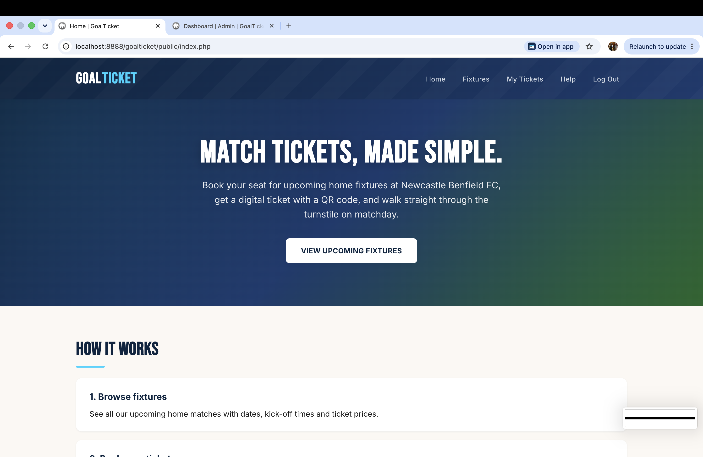
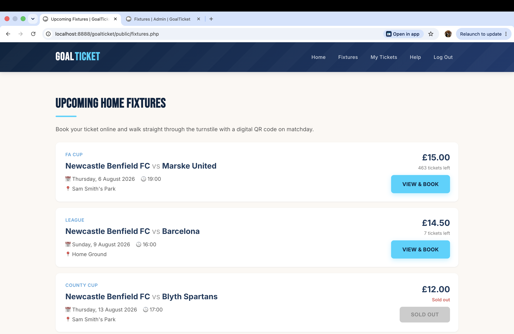
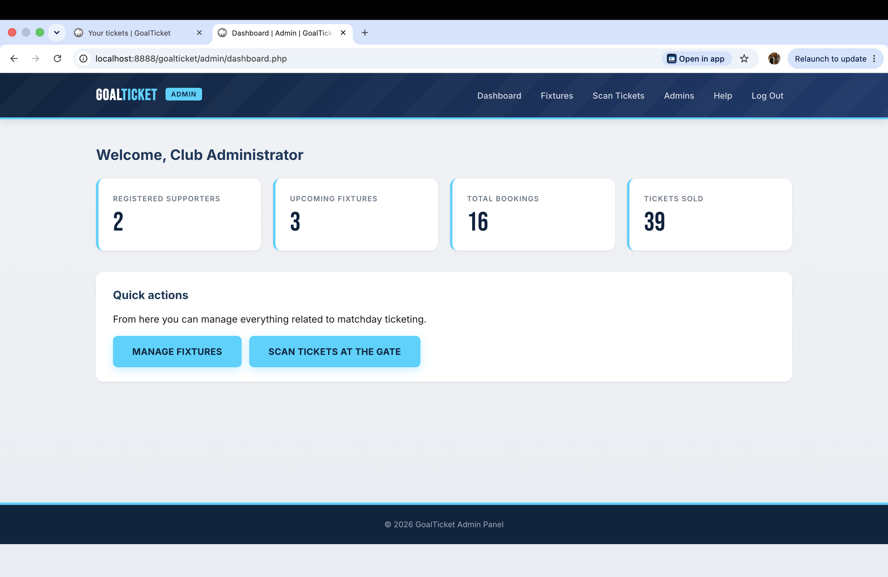

# 🎟 Football Ticketing System

## 📌 Overview

The Football Ticketing System is a web-based application developed as part of my university Work-Based Learning project.

The aim of this project is to create a platform where users can browse football fixtures and manage ticket bookings through a dynamic website.

## 🚀 Features

- User-friendly web interface
- Football fixture management
- Ticket booking functionality
- Database integration
- Admin management system
- Dynamic content using PHP

## 🛠 Technologies Used

- HTML
- CSS
- JavaScript
- PHP
- MySQL
- Apache
- Git/GitHub

## 🚀 Getting Started

### Requirements

- PHP 8.0 or later
- MySQL
- XAMPP, MAMP or another local server
- Composer

### Installation

1. Clone this repository.
2. Create a MySQL database.
3. Import the SQL database file.
4. Update the database credentials in `config.php`.
5. Start Apache and MySQL.
6. Open the project in your browser.

## 🗄 Database

The project uses MySQL for storing:

- User information
- Football fixtures
- Ticket information
- Booking records

## 📂 Project Structure

football-ticketing-system/

├── admin/
├── config/
├── database/
├── images/
├── includes/
├── css/
├── js/
└── index.php
## 📸 Screenshots

### Homepage

### Fixtures

### Admin Dashboard

## 🎯 Learning Outcomes

Through this project I developed skills in:

- Web application development
- Server-side programming with PHP
- Database design and integration
- User interface development
- Project organisation using GitHub

## 👨‍💻 Author

Benjamin Ekay

Computing Student | Aspiring Software Engineer

LinkedIn:
www.linkedin.com/in/benjamin-ekay
